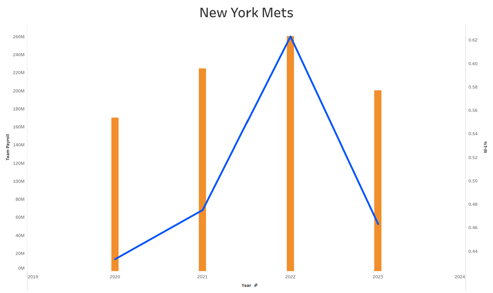
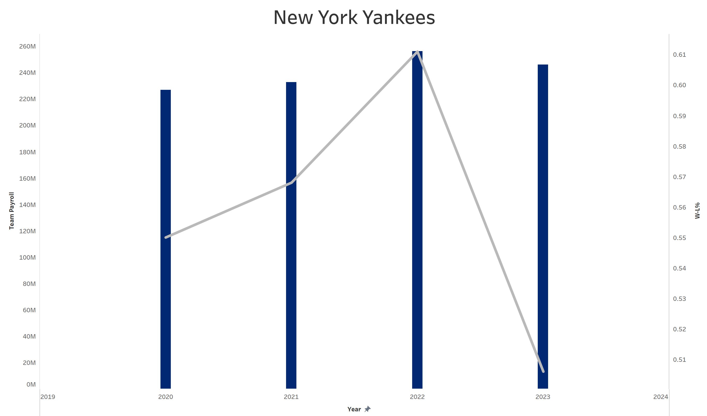
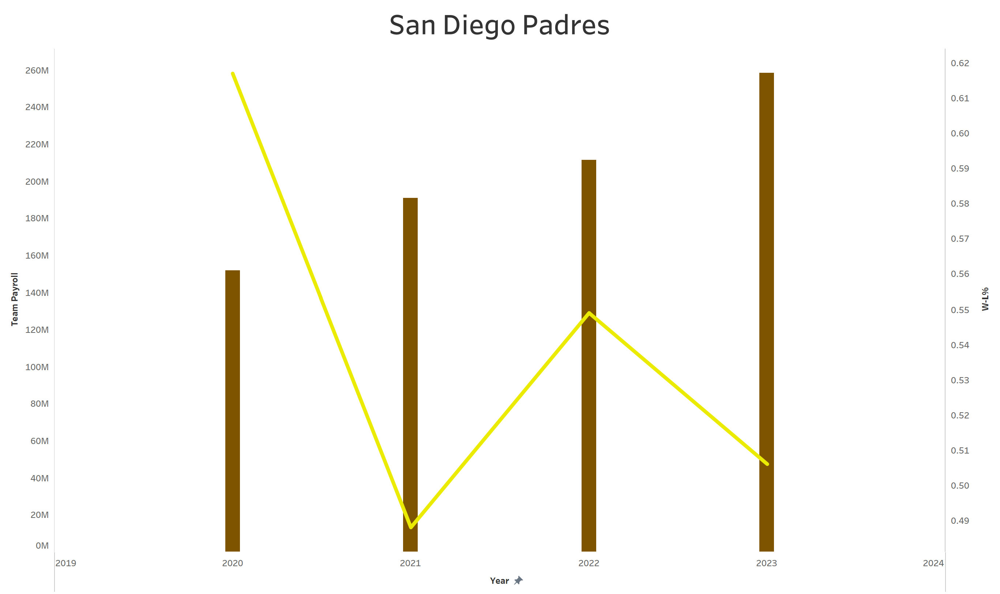
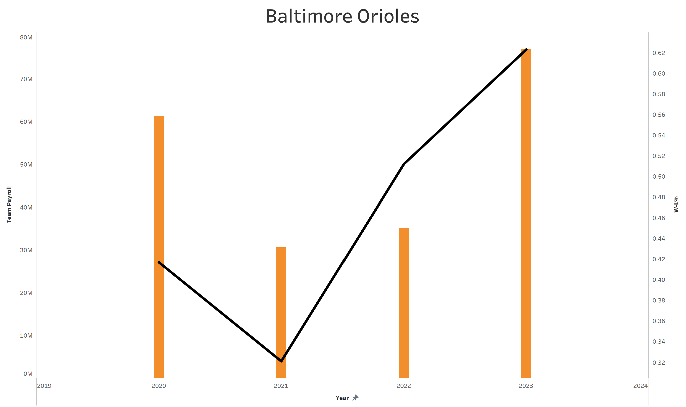
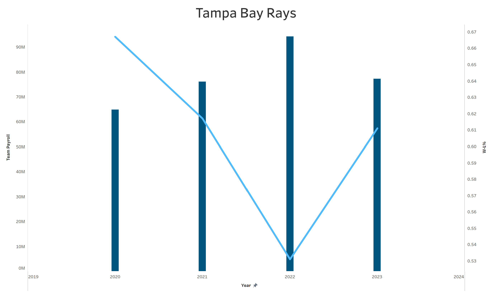

# MLB Payroll Analysis

Author: Caleb Federman 
Latest Revision: 11-Oct-2023

## Table of Contents
- [About](#about)
- [File Structure](#file-structure)

## About

Through this project, I aim to analyze how the distribution of payroll affects the performance of Major League Baseball teams. 

By comparing the distribution of payroll among positions to win percentage, runs scored, and runs allowed, we may find greater value in certain positions or position groups. 

Further analysis of age distribution on the payroll could lead to insights on the benefits of experience vs youth.

## File Structure

### src/

 - scrape_salary_data.py

### data/

- mlb_payroll_data.xlsx
- mlb_standings.csv
- player_salaries.csv
- team_salaries.csv
- MLB_Payroll_Analysis.twb

## Results

### Introduction

In the 2023 MLB season, the three teams with the highest payrolls, each greater than $175 million, all missed the playoffs. 

In the same season, the teams with the third and fourth lowest payrolls in baseball won 99 and 101 games respectively.

This result leads to questions of the impact these ever growing payrolls have on the sport, the only of the US Big Four (MLB, NFL, NBA, NHL) without a salary cap.

### Team Payroll vs Win-Loss Percentage Trends

To start, we will compare the Payroll and Win-Loss Percentage trends from the past four seasons of the three high payroll teams (New York Mets, New York Yankee, San Diego Padres) and the two low payrolls teams (Tampa Bay Rays, Baltimore Orioles). We use Win-Loss Percentage, as opposed to Win Total, due to the shortened 2020 season where each team played just 60 games.

You will notice in the graphs below for the Mets, Yankees, and Padres that the Team Payroll axis has a much larger range, reaching up to $260M. In contrast, the Orioles and Rays Team Payroll axes reach $80M and $90M. This is indicative of the salary tendencies for each of these organizations. 

The Yankees have always been one of the highest paying clubs in the MLB. The Mets and Padres have recently followed suit, thanks to Steve Cohen's purchase of the Mets and AJ Preller's increasing aggression as the Padres' General Manager.

The trends of the Mets and the Yankees are very similar. Both teams achieved their highest Win-Loss Percentage in 2022 before a steep decline in 2023. It appears the cause may be the drops in Team Payroll, however there is one caveat: 

Team Payroll figures are taken from the most recent roster in each season. This means that players traded at the trade deadline, such as Max Scherzer and Justin Verlander for the Mets in 2023, do not count towards the payroll even if their salaries are retained. The discrepancy between the Mets' opening day payroll ($344M) and their end-of-season payroll ($200M) is an outlier, though, since it is very rare for teams to trade away such drastic portions of the total team salary. In future revisions, Team Payroll taken from Opening Day rosters may be more telling of the impact of payroll on W-L%.

Upon further thought we then realize, that in the case of the Mets, the lower payroll figure at the end of 2023 is actually a result of their low Win-Loss Percentage, which led to the trades of expensive players.

TODO: for padres... payroll steadily increasing, but random W-L% results (cause??? randomness of baseball...)

TODO: for orioles... payroll jumped in 2023, but largely due to arbitration deals and 2 FA signings (Kyle Gibson and Adam Frazier) ... improved W-L% due to performance of young, cheap prospects that have panned out

TODO: for rays... they are an outlier club ... made playoffs in each of the last four seasons despite one of the lowest payrolls in the league ... we hope to uncover their secrets upon further review

### More coming soon...

